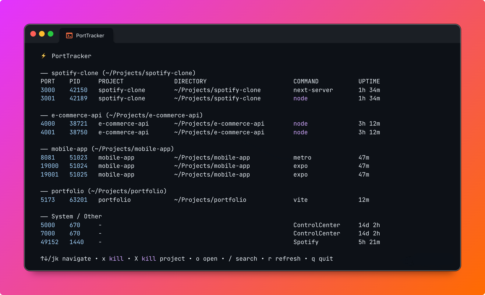

# PortTracker

Not just "what ports are open?" — **"which of my projects are running right now?"**

PortTracker is a fast CLI + interactive TUI that lists your listening ports, detects which project they belong to, and lets you kill them by port or project name. Works on macOS and Linux.



## Why PortTracker?

There are many port killing tools out there. Here's what makes PortTracker different:

| Feature | pt | fkill | killport | kill-port | LazyPorts |
|---|---|---|---|---|---|
| Interactive TUI | Yes | Fuzzy list | No | No | Yes |
| Auto project detection | Yes | No | No | No | No |
| Kill by project name | Yes | No | No | No | No |
| Grouped by project | Yes | No | No | No | No |
| Directory + uptime | Yes | No | No | No | No |
| Search / filter | Yes | Fuzzy | No | No | Yes |
| Kill confirmation | Yes | No | No | No | No |
| Single binary, zero deps | Yes (Go) | No (Node) | Yes (Rust) | No (Node) | Yes (Go) |

Most tools answer "kill port 3000". PortTracker answers **"what's running, where, and for how long?"**

## Install

```bash
# Homebrew (macOS/Linux)
brew install yusufkaran/tap/porttracker

# Quick install
curl -fsSL https://raw.githubusercontent.com/yusufkaran/porttracker/main/install.sh | sh

# Go
go install github.com/yusufkaran/porttracker/cmd/pt@latest
```

## Usage

```bash
pt              # Interactive TUI
pt ls           # List all listening ports
pt kill 3000    # Kill process on port 3000
pt kill my-app  # Kill all processes matching project name
pt 3000         # Shortcut for: pt kill 3000
```

## Features

- **Project grouping** — Ports grouped by project, dev projects on top, system ports dimmed at the bottom
- **Auto project detection** — Reads `package.json`, `go.mod`, `Cargo.toml`, `pyproject.toml`, or falls back to directory name
- **Search** — `/` to filter by port, project, or command name
- **Kill with confirmation** — `x` to kill selected port, `X` to kill entire project, confirms before killing
- **Open in browser** — `o` to open `localhost:<port>` directly
- **Fast** — Single binary, batch port scanning in <200ms

## Keyboard Shortcuts

| Key | Action |
|---|---|
| `j` / `k` / `↑` / `↓` | Navigate |
| `x` | Kill selected port |
| `X` | Kill all ports of selected project |
| `o` | Open in browser |
| `/` | Search / filter |
| `r` | Refresh |
| `q` | Quit |

## License

MIT
